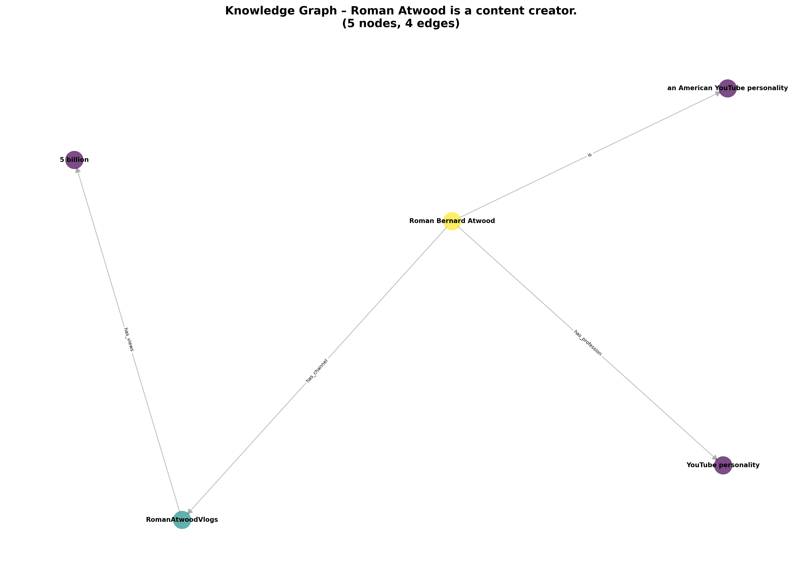

# Graph-Augmented Retrieval-Augmented Generation (GA-RAG)

[](https://www.python.org/downloads/)
[](https://opensource.org/licenses/MIT)
[](https://openai.com/)

A novel **Graph-Augmented Retrieval-Augmented Generation** pipeline that enhances factual grounding and reasoning by constructing per-query knowledge graphs from retrieved documents. Evaluated on the FEVER fact verification benchmark.

## 🎯 Key Features

- **Structured Knowledge Extraction**: LLM-based triplet extraction converting unstructured text to (subject, relation, object) facts
- **Dynamic Graph Construction**: Per-query knowledge graphs using NetworkX
- **PageRank-Style Propagation**: Relevance scoring across graph nodes for evidence ranking
- **Graph-Aware Prompting**: Linearized, ranked fact injection for LLM conditioning
- **Comprehensive Evaluation**: Factual accuracy, hallucination rate, logical consistency, and graph metrics
- **Interpretable Results**: Knowledge graph visualizations and provenance tracking

## 📊 Results Summary

| Metric | Baseline RAG | GA-RAG | Improvement |
|--------|-------------|--------|-------------|
| Factual Accuracy | 0.400 | 0.415 | +3.7% |
| Logical Consistency | 0.500 | 1.000 | **+100.0%** |
| Hallucination Rate | 0.170 | 0.147 | **+13.3%** |
| Response Coherence | 0.850 | 1.000 | +17.6% |
| Graph Coverage | 0.000 | 0.480 | — |
| Context Precision | 0.000 | 0.963 | — |

## 🏗️ System Architecture

```
┌─────────────────────────────────────────────────────────────────┐
│                     GA-RAG Pipeline                              │
│  ┌─────────┐   ┌────────────┐   ┌───────────┐   ┌────────────┐  │
│  │  Query  │──▶│  Retriever │──▶│ Extractor │──▶│   Graph    │  │
│  └─────────┘   └────────────┘   └───────────┘   │  Builder   │  │
│                                                  └─────┬──────┘  │
│  ┌─────────────────────────────────┐  ┌─────────────┐  │        │
│  │ Node Scoring & Propagation      │◀─│ Prompt Gen  │◀─┘        │
│  └─────────────┬───────────────────┘  └─────────────┘           │
│                │                                                 │
│                ▼                                                 │
│          ┌─────────┐                                            │
│          │   LLM   │──▶ Answer + Explanation                    │
│          └─────────┘                                            │
└─────────────────────────────────────────────────────────────────┘
```

## 📁 Project Structure

```
GA-RAG/
├── baseline_rag.py              # Standard RAG implementation
├── graph_augmented_rag.py       # Main GA-RAG pipeline (2281 lines)
├── graph_reasoning.py           # Graph construction & propagation
├── llm_triplet_extraction.py    # LLM-based triplet extraction
├── eval_framework.py            # Evaluation metrics (571 lines)
├── visualization_utils.py       # Graph visualization & plotting
├── dataset_loaders.py           # FEVER/HotpotQA/TruthfulQA loaders
├── download_datasets.py         # Dataset download utilities
├── run_complete_pipeline.py     # Main experiment runner
├── test_setup.py                # Environment verification
├── requirements.txt             # Python dependencies
├── .env.example                 # Environment variables template
├── paper_improved.tex           # IEEE conference paper (LaTeX)
├── results/                     # Experiment outputs
│   ├── comparison_results_*.json
│   ├── detailed_results_*.json
│   └── figures/
│       ├── pipeline_diagram.png
│       ├── factual_accuracy_comparison.png
│       ├── logical_consistency_comparison.png
│       ├── hallucination_rate_comparison.png
│       └── knowledge_graphs/    # Per-query graph visualizations
├── data/                        # Datasets (not included, see setup)
│   ├── fever/
│   ├── hotpotqa/
│   └── truthfulqa/
├── notebooks/                   # Jupyter notebooks for exploration
└── experiments/                 # Experiment configurations
```

## 🚀 Quick Start

### 1. Clone the Repository

```bash
git clone https://github.com/YOUR_USERNAME/GA-RAG.git
cd GA-RAG
```

### 2. Create Virtual Environment

```bash
python -m venv venv

# Windows
.\venv\Scripts\Activate.ps1

# Linux/macOS
source venv/bin/activate
```

### 3. Install Dependencies

```bash
pip install -r requirements.txt

# Download spaCy model (optional, for NER)
python -m spacy download en_core_web_sm
```

### 4. Configure Environment

```bash
# Copy example environment file
cp .env.example .env

# Edit .env with your API key
# OPENAI_API_KEY=your_openai_api_key_here
```

### 5. Download Datasets

```bash
python download_datasets.py
```

This downloads FEVER, HotpotQA, and TruthfulQA datasets (~670MB total).

### 6. Run Experiments

```bash
python run_complete_pipeline.py
```

Results are saved to `results/` directory with:
- `comparison_results_*.json` - Aggregated metrics
- `detailed_results_*.json` - Per-query results
- `figures/` - Visualizations and knowledge graphs

## ⚙️ Configuration

Edit `run_complete_pipeline.py` to customize:

```python
class Config:
    # API Configuration
    MODEL_NAME = "gpt-4o-mini"        # OpenAI model
    
    # Dataset Configuration
    DATASET_TYPE = "fever"             # Options: 'fever', 'hotpotqa', 'truthfulqa'
    MAX_QUERIES = 20                   # Number of test queries
    
    # System Configuration
    USE_SPACY = False                  # Use spaCy for NER
    CONSISTENCY_THRESHOLD = 0.7        # Consistency score threshold
    K_RETRIEVE = 4                     # Number of documents to retrieve
    
    # Visualization
    SAVE_GRAPH_VISUALIZATIONS = True   # Save knowledge graph images
    GRAPH_VIZ_MAX_NODES = 40           # Max nodes in graph visualization
```

## 📈 Evaluation Metrics

| Metric | Description |
|--------|-------------|
| **Factual Accuracy** | Label agreement with ground truth (SUPPORTS/REFUTES/NOT ENOUGH INFO) |
| **Logical Consistency** | Internal consistency of answers (no contradictions) |
| **Hallucination Rate** | Proportion of unsupported tokens in response |
| **Response Coherence** | Fluency and grammatical correctness |
| **Graph Completeness** | Ratio of extracted facts to theoretical maximum |
| **Graph Coverage** | Proportion of query entities in the graph |
| **Factual Grounding** | Answer tokens supported by graph nodes |
| **Context Precision** | Ratio of relevant to total retrieved facts |

## 🧠 Algorithms

### Initial Node Scoring
```
s_i^(0) = α · sim(q, d_i) + β · (1 / rank_i)
```

### Graph Propagation (PageRank-style)
```
s_i^(t+1) = (1-γ) · s_i^(0) + γ · Σ_j (w_ji / Z_j) · s_j^(t)
```

### Final Ranking
```
rank(i) = λ_1 · s_i^(T) + λ_2 · centrality(i) + λ_3 · confidence(i)
```

## 📊 Example Knowledge Graph



*Knowledge graph constructed for the claim: "Roman Atwood is a content creator."*

## 🔧 API Support

Currently supports:
- **OpenAI API** (GPT-4o-mini, GPT-4o, GPT-4)

Legacy support available for:
- OpenRouter (DeepSeek, Claude, etc.)

## 📝 Citation

If you use this work, please cite:

```bibtex
@inproceedings{garag2025,
  title={Graph-Augmented Retrieval-Augmented Generation for Fact Verification},
  author={Your Name},
  booktitle={Proceedings of IEEE Conference},
  year={2025}
}
```

## 📄 License

This project is licensed under the MIT License - see the [LICENSE](LICENSE) file for details.

## 🤝 Contributing

Contributions are welcome! Please:
1. Fork the repository
2. Create a feature branch (`git checkout -b feature/amazing-feature`)
3. Commit changes (`git commit -m 'Add amazing feature'`)
4. Push to branch (`git push origin feature/amazing-feature`)
5. Open a Pull Request

## 🙏 Acknowledgments

- [FEVER Dataset](https://fever.ai/) - Fact verification benchmark
- [LangChain](https://langchain.com/) - LLM orchestration framework
- [NetworkX](https://networkx.org/) - Graph operations library
- [OpenAI](https://openai.com/) - LLM API provider

## 📧 Contact

For questions or feedback, please open an issue or contact [your.email@university.edu].

---

**Note**: This project was developed as part of an Agentic AI research project demonstrating autonomous reasoning and knowledge graph-based fact verification.
